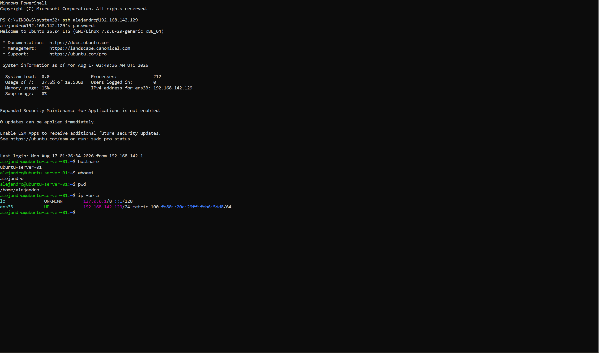
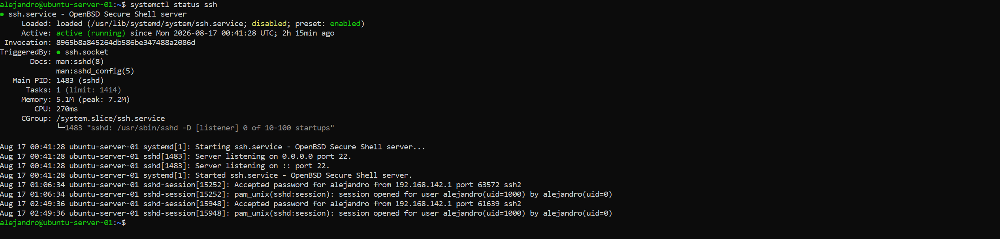
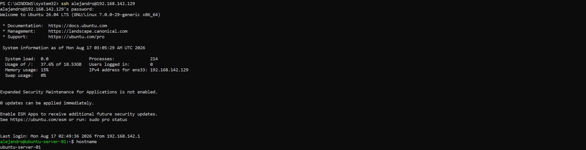

# Lab 01 - Ubuntu Server Basics

## Objective

Set up an Ubuntu Server virtual machine and learn basic Linux system administration, file management, networking, and remote access using SSH.

## Environment

- Ubuntu Server 26.04 LTS
- VMware Workstation Pro
- Windows host machine
- OpenSSH Server

## What I practiced

- Connecting remotely to a Linux server using SSH
- Identifying the current user hostname
- Navigating the Linux filesystem
- Creating directories and files
- Reading and modifying text files
- Copying, moving, renaming, and deleting files
- Working with relative paths
- Checking network configuration
- Verifying the SSH service

## Commands Practiced

### System Information

- whoami
- hostname
- pwd
- ip a

### File and Directory Management

- ls
- ls -l
- ls -la
- mkdir
- cd
- cd ..
- cd ~
- touch
- cat
- cp
- mv
- rm
- rmdir
- rm -r

### SSH and Services

- systemctl status ssh
- ssh username@server-ip

## What I Learned

- Relative paths allow me to access files inside subdirectories without changing my current directory.
- cd .. moves up one directory level, while cd ~ returns directly to my home directory.
- rm removes files, while rmdir removes empty directories. rm -r recursively removes a directory and its contents.
- cp creates a copy of a file, while mv can rename a file or move it to another directory.
- ls -la displays detailed information and and includes hidden files.
- An IP address identifies a system on a network and can be used to connect to a remote server using SSH.
- systemctl status ssh can be used to verify that the SSH service is running and ready to accept remote connections.

## Screenshots

### Server Identity and Network

### SSH Service Status

### SSH Remote Connection

